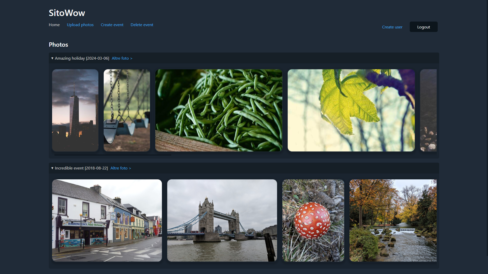

# photoSite
Very scuffed website for showing photos (and videos) grouped by events.

You can create events, delete events, upload photos linked to an event, delete photos (right click to select them in the event page),
and see the location in which they were taken.

(Wow amazing!)

You can also create accounts to give your friends access to your website without giving them permission to upload/delete photos.

(Even more wow!) 🦧

For now the front-end is partly in English and partly in Italian, someday I'll change it... surely...

## Setup
Set the following environment variables in your project's `.env` file:
```
DB_PASSWORD=<your-db-password>
ADMIN_NAME=<photoSite-admin-name>
ADMIN_PASSWORD=<photoSite-admin-password>
```
Put your tls certificate and key (named `cert.pem` and `key.pem`) in `./tls`

## Run
```
# docker-compose up -d
```
To see logs ඞ:
```
# docker-compose logs -f
```

The server relies on exiftool, ffmpeg and imagemagick to elaborate photos and videos. I suggest using docker to ensure there are no errors given by missing dependencies or tools with different names from those used in the distro used by the container (imagemagick 👀)

## Screenshots



